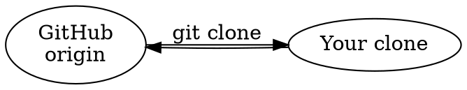

# Flow Lab — animated workflow diagrams

A prototype that combines two ideas:

1. **Graphviz DOT** is a great way to *describe* a directed acyclic graph — what exists and how it connects.
2. **Animated tutorials** are a great way to *teach* a sequence — what happens, in what order.

Flow Lab treats those as two canon files per tutorial: a **DOT graph** (structure) and a
**timeline** (narration). A runtime lays out the graph, chooses icons, and plays the timeline
as an animated SVG — live in the page, or exported as a single self-contained
SMIL-animated `.svg` file with no scripts.

The files are the canon. The player is one renderer; the exported SVG is another.

Open the playground: [`/flow/`](https://hoopsomuah.github.io/cli-agents/flow/) (or serve the
repo locally and browse to `/flow/`).

---

## 1. The graph file (DOT subset)



Supported: `digraph { }`, `rankdir`, node statements with `label` and `icon` attributes,
edge statements with `label`, edge chains, `node [...]` / `edge [...]` defaults, quoted
strings with `\n` line breaks, and `//` `/* */` `#` comments.
Not supported (yet): subgraphs/clusters, ports, HTML labels, undirected graphs.

Layout is automatic: a small layered (Sugiyama-style) pass — rank by longest path,
barycenter ordering to reduce crossings, curved edges with arrowheads. No dependencies.

## 2. The timeline file

Line-based; **each line is one step**. A step is `actions : caption @duration`.

```text
timeline "How a pull request works"

show origin              : The shared repository lives on GitHub.
origin ->> local         : git clone copies the history to your machine.  @2s
highlight local          : This copy is yours to break.
unhighlight local
dim origin, show all     : The whole picture.  @2.5s
```

| Action | Meaning |
| --- | --- |
| `show a, b, a->b` | reveal nodes / edges (edges draw on; nodes pop in) |
| `hide x` | remove something from the stage |
| `a ->> b` | **message pulse** — a dot travels along the edge (mermaid-sequence flavored). Works in reverse if only the `b -> a` edge exists. |
| `highlight x` / `unhighlight x` | ring a node / accent an edge |
| `dim x` / `undim x` | fade something into the background |
| `pause` | a caption-only beat |
| `all` | valid target everywhere: `show all`, `dim all`, … |

Conveniences: pulsing or highlighting something hidden reveals it first; revealing an edge
reveals its endpoints. `@2.5s` stretches a step. `//` and `#` start comments.

## 3. Icons

Nodes get icons three ways, in priority order:

1. **Explicit** — `icon=star` in the DOT file.
2. **Auto-pick** — keywords in the node's id/label are matched against the library
   (`"GitHub origin"` → `cloud`, `"Reviewer"` → `person`, `"CI checks"` → `gear`, …).
3. **Stable fallback** — a hash of the node id into the primitive shapes, so an unnamed
   node keeps the same shape across edits.

Every icon is a fragment of stroke-based SVG in a 48×48 box centered on the origin, using
`currentColor`. That contract is what makes the library swappable — **replace the icons,
re-render, and every animation updates**. Bring your own set:

```js
import { registerIcon } from './js/icons.js';
registerIcon('kubernetes', '<path d="..."/>', ['k8s', 'cluster', 'pod']);
```

## 4. Export

**Download animated SVG** produces a single standalone file: SMIL animations, resolved
colors from the active palette, no scripts, no external references. It plays in any modern
browser — opened directly, embedded via ``, or committed to a repo. (Non-browser SVG
viewers may not support SMIL or `oklch()` colors; the export targets browsers.)

## 5. Module map

```
flow/
├── index.html        playground UI
├── flow.css          playground styles (reads ../site/css/tokens.css)
└── js/
    ├── dot.js        DOT-subset parser                  (pure, no DOM)
    ├── layout.js     layered DAG layout + edge routing  (pure, no DOM)
    ├── icons.js      icon registry + auto-picker        (pure, no DOM)
    ├── timeline.js   DSL parser → bound steps → absolute schedule (pure)
    ├── scene.js      graph → render-ready model shared by both renderers
    ├── player.js     live SVG player — state is a pure function of time
    ├── export.js     standalone SMIL-animated SVG serializer
    ├── examples.js   bundled example workflows
    └── main.js       playground wiring
```

The pure modules run in Node too (`node --input-type=module -e "import(...)"`), which is
how the smoke tests exercise the parser, layout, and scheduler without a browser.

## Ideas for the next round

- Real icon sets (Lucide, Azure/AWS architecture icons) registered through `registerIcon`,
  and an "icon pack" file format so packs can be swapped per organization.
- Semantic icon choice from a model instead of keyword matching.
- Parallel step groups (`a ->> b & c ->> d` in one beat), loops/repeats, and camera moves
  (zoom to a subgraph) for larger stories.
- A CLI that renders `.dot` + `.timeline` pairs to `.svg` in bulk — regenerate every
  tutorial when the icon library changes.
